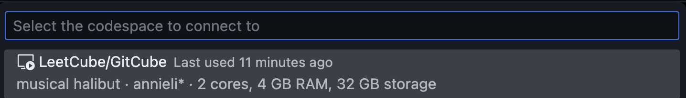

# GitHub Codespaces on VSCode

**abbreviations**

-   VSCode: vsc
-   GitHub: gh
-   GitHub Codespaces: codespaces

## Steps

0. What are codespaces?

-   [codespaces official](https://github.com/features/codespaces)

> GitHub Codespaces run on a variety of **VM-based** compute options hosted by GitHub.com, which you can configure from **2 core machines up to 32 core machines**. You can **connect** to your codespaces **from the browser or locally using an IDE** like Visual Studio Code or IntelliJ.
>
> From codespaces official

-   codespace is a cloud dev environment

    -   codespace is remote
    -   your machine is local

-   if you are familiar with [Amazon EC2](https://aws.amazon.com/ec2/), codespace is similar

    -   you can create one or multiple codespaces
    -   specify how many cores
    -   start a codespace when you use it
    -   stop a codespace when you are done

-   codespace uses linux VM, which comes with bash shell

    -   if you are using Windows, not only is the set up process for common tools such as `make` very difficult to follow, but also the set up is often unsuccessful with strange errors
    -   codespace has common tools already set up, so you can start calling `make` and others in the shell

    

-   download [vsc](https://code.visualstudio.com/)

1. billing

-   gh offers free 120 **core hours** / month, which is **not** the same as 120 **hours** / month
-   let $c$ rep. core, and $h$ rep. hrs
-   $120 ch = 1 c \cdot 120 h$, however, there's no 1 core machine
-   $\cfrac{120 ch}{2c} = 60h$, $\cfrac{120 ch}{4c} = 30h$, $\cfrac{120 ch}{8c} = 15h$
-   we have at most free 60 hours / month
-   we'll discuss spending limit later, once we have created a codespace

2. codespace settings

-   in gh settings, click codespaces

-   update your trusted repos

-   select your favourite editor
-   your codespace will stop after idle timeout, use a small value here

3. download codespaces extension in vsc

4. create a new codespace

-   go to [codespace](https://github.com/codespaces), also bookmark this
-   click **New codespace**
    

-   select your repo and branch, and you should select the region closest to you
-   click **Create codespace**

-   once you are inside, the remote button at bottom left should say **Codespaces**

5. this flow chart on stages will be our helpful guide

-   is running?: means whether codespace is running or not
-   is connected?: means whether we are connected to codespace
-   there are 3 scenarios
    -   I've used traffic light colours 🟥 🟨 🟩
    -   not running + connected does not exist
-   billing
    -   you are billed when codespace is running 🟩 🟨, regardless whether you are connected to it
    -   you aren't billed when codespace is not running 🟥

6. moving between stages

-   clicking the remote button gives us diff options, depends whether we are in codespace or not
-   **in codespace**, we can click
    -   🟥 **Stop Current Codespace**: stop
    -   🟨 **Close Remote Connection**: disconnect
    -   🟩 **Connect to Codespace**: connect to _another_ codespace, also starts it

-   **in local**, we can click
    -   🟩 **Connect to Codespace**: connect to codespace, also starts it

    -   you can select which codespace to connect to

7. gh shows whether codespace is running or not

-   running

-   not running

8. we can also start / stop codespacees on gh

-   start 🟨, then vsc connects 🟩

-   stop 🟥

9. spending limit

-   if we don't add payment info
    -   gh will auto stop after free 120 **core hrs** / month
    -   spending limit is 0

-   if we add payment info

    -   we can set up a spending limit

-   I suggest code locally, and only use codespace to run bash shell, or as a clean environment to do testing

## Now you have created your first codespace!
