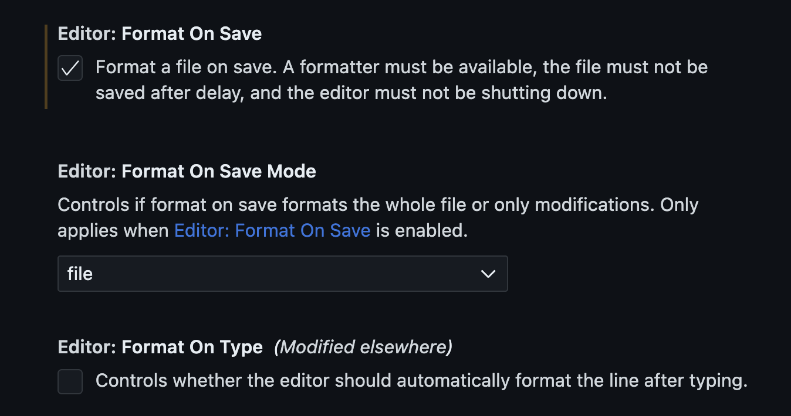
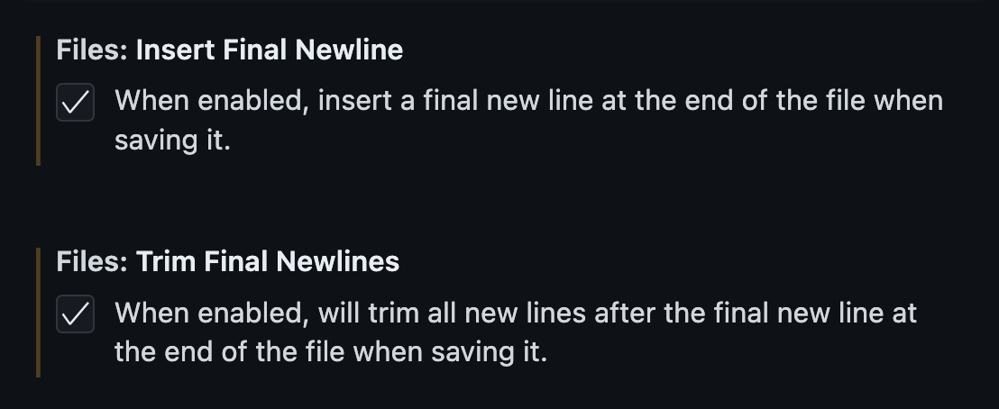
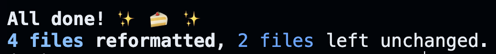
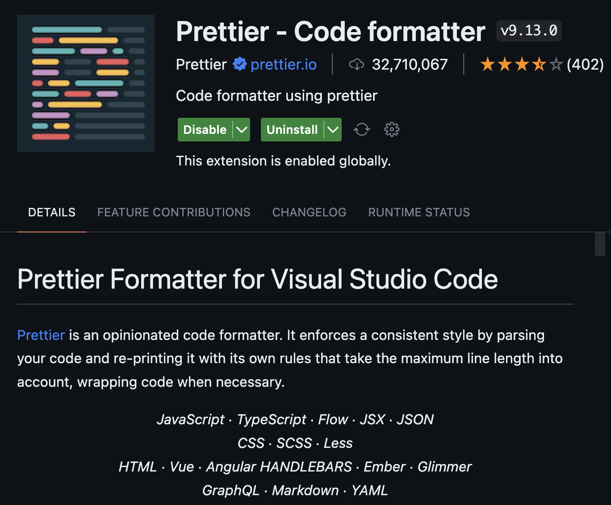

# Formatting

Before uploading your code, please format it with a code formatter.

Definition from [freeCodeCamp](https://www.freecodecamp.org/news/using-prettier-and-jslint/)

> Code formatters are automated tools that help you format source code _automatically_. The main purpose of code formatters is to standardize the formatting of code across a project or team, making it **easier to read and understand code**.

**Note: please keep function signatures as they are on LeetCode**.

## Editor

1. Auto format when you save the file
   
2. Auto add only 1 newline
   
3. Can also use keyboard shortcut `shift + option + f` to format file

## Python

`any` uses [black](https://github.com/psf/black).

-   To install, use `pip install black`. VSCode doesn't have black pre-installed, even though it shows black as an option.

-   To run on 1 file, use `shift + option + f`

-   To bulk run, use `python -m black {source_file_or_directory}`.

Output e.g.

## JS, TS, JSON, and Markdown

`any` uses [prettier](https://prettier.io/).

-   To install, search for prettier in VSCode extension. Then you are all set!
    

-   To run on 1 file, use `shift + option + f`

-   To bulk run, use `npx prettier --write {source_file_or_directory}`.
