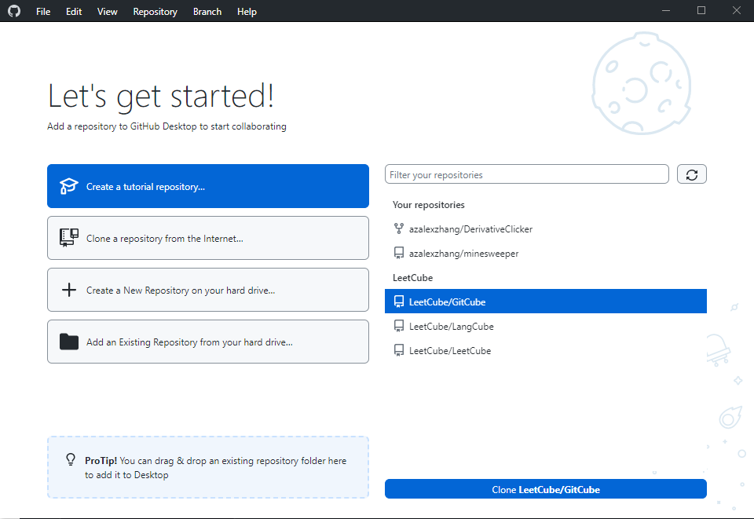
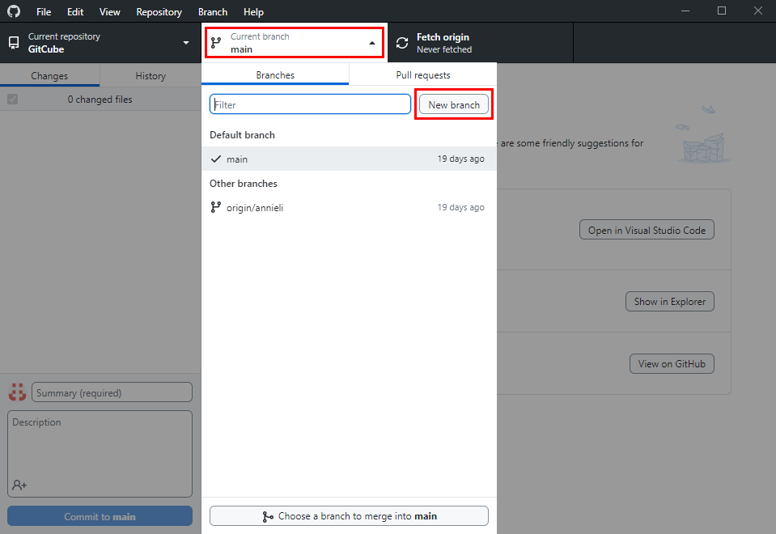
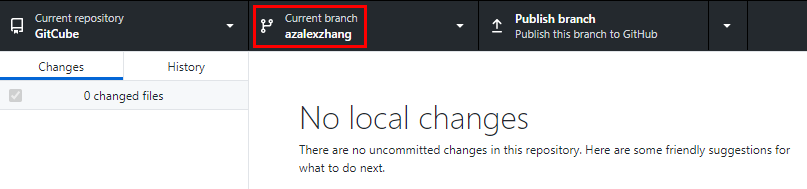
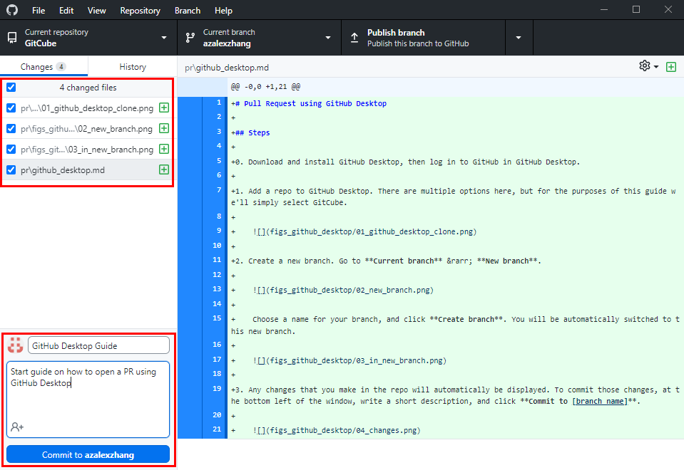

# Pull Request using GitHub Desktop

## Steps

0. Download and install GitHub Desktop, then log in to GitHub in GitHub Desktop.

1. Add a repo to GitHub Desktop. There are multiple options here, but for the purposes of this guide we'll simply select GitCube.

    

2. Create a new branch. Go to **Current branch** &rarr; **New branch**.

    

    Choose a name for your branch, and click **Create branch**. You will be automatically switched to this new branch.

    

3. Any changes that you make in the repo will automatically be displayed. To commit those changes, at the bottom left of the window, write a short description, and click **Commit to [branch name]**.

    

    - The changed files are displayed on the left. Click on each file to view the changes.
    - You can choose which files to commit by checking the boxes to the left of each file.
