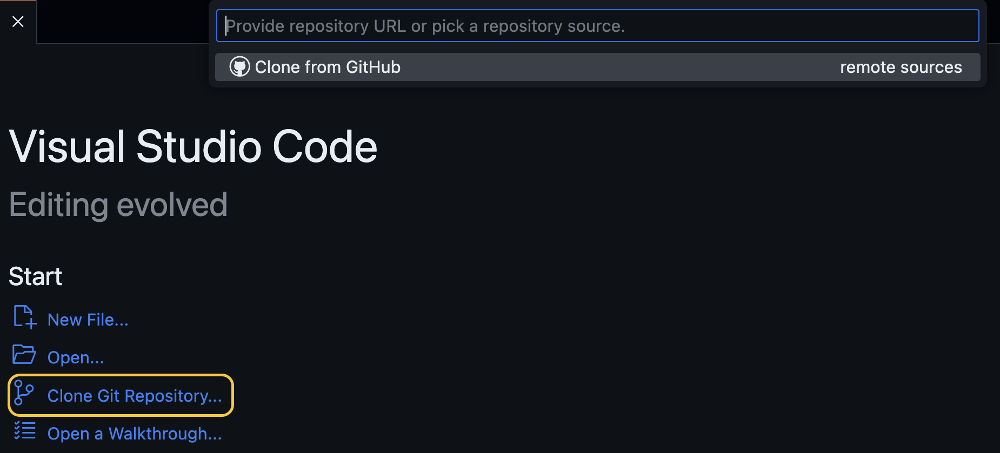
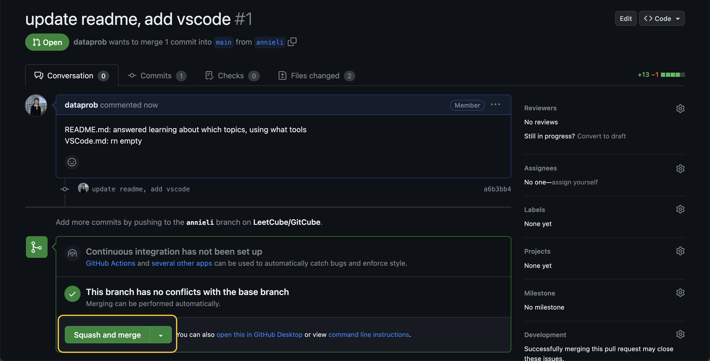
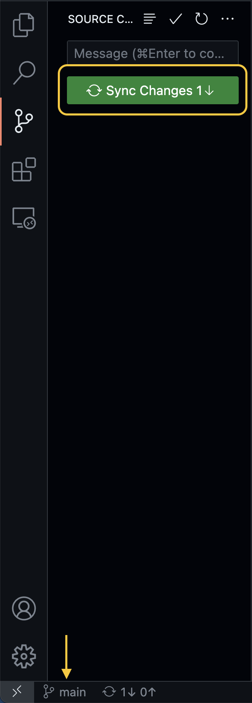

# Pull Request on VSCode

**abbreviations**

- pull request: pr
- VSCode: vsc
- GitHub: gh

## Steps

0. download vsc

1. in vsc, sign in GitHub

   

2. click **clone repo** in welcome page

   

3. select your repo, here we use GitCube

   

4. create new branch

   

   - on bottom left of vsc, you can see we are on `main`
   - click on branch button, select **create new branch from**

5. select from `origin/main`, now branch button should show your branch

   

6. add

   

   - after doing changes, you can see them in git pane
   - hover to **Changes**, click ➕ button, this is `git add` all
   - can also hover on individual file, ➕ and ➖ to toggle between **Changes** and **Staged Changes**

7. commit

   

   - click **Commit** ✅ will `git commit` **Staged Changes**
   - files in **Changes** won't be in commit

8. write a short commit message, then click **Commit**

   

9. push

   - the 1st time you push, you'll see **Publish Branch**

     

   - after the 1st time, you'll click `...`, select **Push**

     

10. go to gh, now you can do a pr, select **Compare & pull request**

    

11. write a pr desc, then click **Create pull request**

    

12. squash merge

    

    - we'll cover this topic in the future: you need to pass your code review, and status checks (if there are any)
    - here in GitCube we only allow squash merge, but in other repos you might see merge as default
    - finally, click **Squash and merge**

13. merged

    

    - now pr is merged, don't click delete
    - we'll cover this topic in the future: **Delete branch** is for feature branches

14. on gh main page, you can see pr `#`

    

15. on gh branches page, we need to fix commits ahead of main

    

16. pull main

    

    - in vsc, switch branch to main, and click **Sync Changes**
    - this pulls newest changes from `origin/main`, `git pull`

17. switch to your branch

    

18. this will reset the count

    

```shell
git reset --hard main
git push --force-with-lease
```

confirm your branch is correct by checking pr `#`

19. on gh branches page, you should see your branch and `main` are the same


## Now you've opened your 1st pr!
